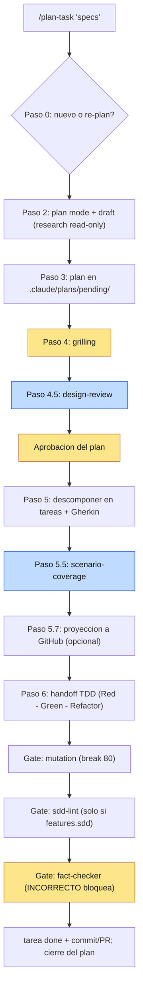

# task-pipeline — flujo de trabajo guiado por Claude Code

> Resumen pensado para presentar el pipeline al equipo. Para instalación y
> referencia completa de config, ver el [README del plugin](../README.md).

## Qué es

Un plugin de Claude Code que convierte una idea ("quiero añadir X") en **tareas
pequeñas, especificadas en Gherkin y listas para TDD**, atravesando varios
**gates de calidad** antes de tocar código. No es fire-and-forget: hay
checkpoints humanos por diseño.

> Las skills son **playbooks que Claude sigue** (model-driven), no scripts
> deterministas.

## El pipeline de un vistazo

Los nodos **amarillos** son checkpoints humanos no negociables; los **azules**, subagentes frescos.



Los **gates de cierre por tarea** corren en orden: **`mutation` → `sdd-lint` (solo con `features.sdd`) →
`fact-checker`**. `mutation` y `sdd-lint` son configurables/condicionales; `fact-checker` y los dos
checkpoints humanos (`grilling`, aprobación del plan) **no son negociables**.

## Las skills

| Skill | Rol |
|---|---|
| `/task-init` | **Bootstrap** del repo: crea el esqueleto `.claude/…`, el `task-lifecycle.md` y el HOW-TO de un package. Se usa **una vez** tras instalar. |
| `/plan-task` | **Orquestador** del pipeline completo (incluye el caso re-plan de un plan activo). |
| `grilling` | Interrogatorio que refina el plan **una pregunta a la vez** (rama por rama). |
| `design-review` | Revisión **holística adversaria** del plan vía **subagente fresco** (sin sesgo de autor): coherencia, tamaño correcto, mantenibilidad, escalabilidad, reversibilidad. |
| `scenario-coverage` | Endurecimiento **QA** de los escenarios Gherkin vía subagente fresco: busca huecos por dimensiones (fronteras, errores, estado, concurrencia, requisitos ausentes). |
| `/mutation` | Gate de **mutation testing** (Stryker + Vitest), por tarea, con bucle de matar survivors. |
| `/doctor` | **Mantenimiento**: diagnostica y alinea un repo ya adoptado con la versión actual del plugin (verifica read-only → fix con diff y aprobación). No es un paso del pipeline; se usa tras actualizar el plugin. |
| `fact-checker` | **Gate de cierre** (no fase de plan): verifica la **veracidad de las afirmaciones** de la sesión (código, tests, librerías, imports) vía subagente fresco → VERIFICADO/INCORRECTO/NO VERIFICABLE. Lo invoca la DoD al cerrar cada tarea (tras `/mutation`), no se auto-ejecuta. Frontera con `/doctor`: veracidad de afirmaciones vs drift de convención. |
| `/sdd-lint` | **Gate de cierre de la capa SDD** (solo con `features.sdd` on): valida **formato + completitud** de los artefactos SDD (spec EARS · caso-de-uso Gherkin · ADR MADR) — mecánico (comandos `grep`/`test`) + semántico (subagente fresco). ERROR bloquea / AVISO no; corre **entre `/mutation` y `fact-checker`**. Invocable a mano (`/sdd-lint [package]`); helper Bash opcional para CI en `scripts/sdd-lint.sh`. |
| `/pipeline-usage` | **Analítica de uso** on-demand (read-only): tokens/modelo/tiempo, desglose **por fase** y **por subagente** de la sesión, leyendo el transcript. Best-effort (formato interno no soportado; titular = total de sesión). **No** es una fase del pipeline: invocarla es el opt-in. |

## Las dos ideas clave

### 1. Gherkin es la fuente de los tests

Cada tarea describe su comportamiento en escenarios `Given / When / Then`, y son
**1:1 con los tests TDD** (el `Then` es el assert). Reglas de calidad que exige
el template:

- **Declarativo > imperativo** → el `When` es una acción de dominio, no pasos de
  UI. Esto es lo que evita tests frágiles a refactors.
- **Un escenario = un comportamiento**, disciplina G/W/T estricta.
- **`Scenario Outline`** para fronteras / clases de equivalencia.

```gherkin
Feature: <capacidad de la tarea>

  Scenario: <caso concreto>
    Given <precondición>
    When <acción de dominio>
    Then <resultado observable y verificable>
```

### 2. Gates con coste proporcional

- 🔒 **No negociables** (baratos y nucleares): `grilling`, la **aprobación del
  plan** y, al cerrar cada tarea, `fact-checker` (verifica las afirmaciones; un
  `INCORRECTO` bloquea el cierre). Ningún flag, preset ni "es que es pequeño" los
  desactiva.
- ⚙️ **Por defecto ON, salto solo en planes triviales**: `design-review` y
  `scenario-coverage` (las dos pasadas caras por subagente). El salto **lo decide
  el usuario** (no Claude en silencio), exige criterios estrictos —una sola
  decisión replicada, sin contrato nuevo ni decisión arquitectónica (y, para
  `scenario-coverage`, 1 tarea sin caminos de error reales)— y **se loguea** en el
  Plan change log. Se pregunta **una vez por pasada**, caduca si una
  re-planificación rompe los criterios, y sin canal para preguntar la pasada se
  ejecuta. Los criterios completos, con su frontera resuelta por ejemplo, están en
  la skill `plan-task`.

## Configuración por repo (`.claude/task-pipeline.yml`)

El pipeline se adapta sin imponer estructura. Resolución (de menor a mayor
prioridad): `defaults (full)` → preset `mode:` → claves explícitas en
`stack:` / `features:`. **Sin archivo = todo `full`** (comportamiento histórico).

| `mode` | tdd | docs | mutation-gate | Para |
|---|---|---|---|---|
| `full` (default) | ON | ON | 80 | repos con tests sanos |
| `legacy` | ON | ON | OFF | testeas lo que tocas, sin llegar a 80 |
| `docs-only` | OFF | ON | OFF | solo orquestar planes + documentar |

`stack:` (`language` / `package-manager` / `test-runner` / `mutation-tool`) hace
que las skills elijan comandos reales en vez de asumir pnpm/Vitest/Stryker. En
**monorepos poliglotas**, `stack.packages.<pkg>` pisa el stack **por-workspace**
(herencia parcial), y `/mutation` elige la herramienta por package (Stryker verificado ·
`mutmut` · escape `mutation-command`). Regla de resolución canónica en el README del plugin.

`models:` fija el modelo de las fases con subagente: **3 siempre** (`design-review`,
`scenario-coverage`, `fact-checker`) **+ `sdd-lint`**, condicional a `features.sdd` on. Ver [Routing de
modelo por fase](../README.md#routing-de-modelo-por-fase-models) en el README del plugin.

## Capas opt-in (default off, salvo que se diga)

Sin tocar `.claude/task-pipeline.yml`, **nada de esto se activa** — el comportamiento por defecto es el
pipeline base de arriba. Cada capa se enciende con su flag:

| Capa | Flag | Qué aporta |
|---|---|---|
| **SDD nativo** | `features.sdd` | Specs vivas: requisitos **EARS** (`spec.md`), casos de uso **Gherkin** (`caso-de-uso.md`, única fuente del Gherkin), decisiones **ADR/MADR**. Con activación asistida (`/task-init`/`/doctor` preguntan) y **gate `/sdd-lint`** de formato + completitud al cerrar. |
| **Git automation** | `features.git-automation` | `auto-commit` al cerrar la tarea, `auto-pr` al cerrar el plan, `co-author` configurable. |
| **Conventional commits** | `features.conventional-commits` | **Default ON**: exige `<task-id>: <conventional commit>`; `false` lo relaja. |
| **GitHub tracking** | `features.github-tracking` | Proyección one-way `.md`→GitHub: plan→issue **padre**, tarea→**sub-issue**, con estado (label + Project) y assignee. |
| **Modo caveman** | `features.caveman` | Comprime el output del hilo principal (hook `UserPromptSubmit`), con backoff en los checkpoints. |

Todas son **opt-in fuera de preset**; su **ausencia no es drift** para `/doctor`. Detalle y garantías de cada
una en el [README del plugin](../README.md).

## Estructura que asume en el repo

```
.claude/
  plans/<estado>/<package>/<name>.md      # pending|active|completed|cancelled
  tasks/<estado>/<package>/<task-id>.md   # incluye ## Scenarios (Gherkin)
  context/<package>/<task-id>.md          # session log (append-only)
  specs/<package>/HOW-TO-START-A-TASK.md  # gate de ejecución por package
  task-pipeline.yml                       # config del repo
docs/guides/task-lifecycle.md             # flujo canónico
```

## Cómo se adopta

1. **Instalar**: `/plugin marketplace add ~/claude-plugins` →
   `/plugin install task-pipeline@local-plugins`
2. **Bootstrap una vez**: `/task-init <package>`
3. A partir de ahí: `/plan-task "<lo que quieras hacer>"`

Un hook `SessionStart` auto-repara el esqueleto si el repo ya está adoptado (y es
no-op en repos ajenos: el plugin es global).

## Ejemplo end-to-end

Caso real: *"quiero que la API rechace registros con email duplicado"* en el
package `auth`.

**Paso 0 — ¿nuevo o re-plan?** No hay plan activo que cubra el scope → plan
nuevo.

**Paso 1 — package + nombre.** Package `auth`; plan `reject-duplicate-email`.

**Paso 2 — plan mode + draft.** Claude entra en plan mode, explora el repo en
read-only (dónde vive el registro, qué valida hoy) y redacta el plan desde
`templates/plan.md`. Lo presenta con `ExitPlanMode`.

**Paso 3 — escribir en pending.** Aprobado el draft, se escribe
`.claude/plans/pending/auth/reject-duplicate-email.md`
(`status: pending`, `branch: plan/auth/reject-duplicate-email`).

**Paso 4 — `grilling` 🔒.** Una pregunta a la vez:
*¿case-insensitive? ¿qué status HTTP? ¿condición de carrera entre check e insert?*
Cada decisión se registra en el **Plan change log**. La carrera obliga a apoyarse
en el índice único de BD, no solo en un check previo → el plan se ajusta.

**Paso 4.5 — `design-review`.** Un subagente fresco mira el conjunto: la
validación debe vivir en el dominio, no en el controller. Hallazgo aceptado →
al Plan change log.

**Paso 5 — descomponer + Gherkin.** Dos tareas pequeñas, cada una desde
`templates/task.md` con su `## Scenarios (Gherkin)`:

```gherkin
Feature: Registro rechaza email duplicado

  Scenario: email ya registrado
    Given existe un usuario con email "ana@acme.io"
    When se intenta registrar otro usuario con "ana@acme.io"
    Then el registro se rechaza con conflicto
    And no se crea un segundo usuario

  Scenario Outline: normalización de email antes de comparar
    Given existe un usuario con email "ana@acme.io"
    When se intenta registrar con "<entrada>"
    Then el registro se rechaza con conflicto

    Examples:
      | entrada         |
      | ANA@acme.io     |
      | ana@ACME.IO     |
      |  ana@acme.io    |
```

**Paso 5.5 — `scenario-coverage`.** El subagente QA detecta un hueco: nada cubre
la **carrera concurrente** (dos requests simultáneos con el mismo email). Se
añade un escenario que ejercita el índice único; las dimensiones irrelevantes se
descartan con su porqué.

**Paso 6 — handoff TDD.** Cada tarea se ejecuta en su sesión siguiendo el
`HOW-TO-START-A-TASK.md` de `auth`: Red (test desde el `Then`) → Green →
Refactor. Commits `<task-id>: <conventional commit>` en la rama del plan.

**Paso 7 — `/mutation` 🔒.** Antes de cerrar cada tarea, Stryker corre con
`break: 80`. Un survivor revela que el test no distingue mayúsculas → se endurece
el assert. Verde el gate → tarea a `completed` y aprobación final del plan.

