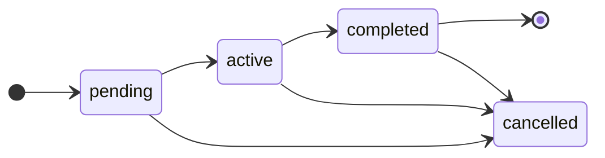
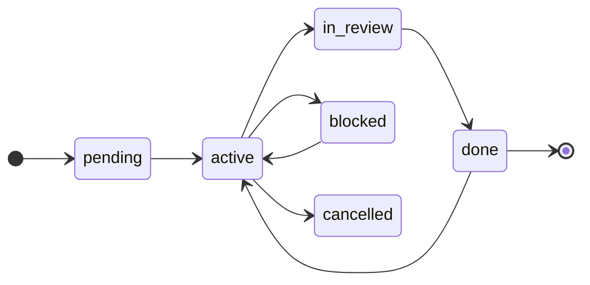

# Estados

El **`status:` del frontmatter es la fuente de verdad**. Al cambiarlo, el `.md` **se mueve** de carpeta
(`pending/` → `active/` → `completed/` | `cancelled/`) en **una sola operación**: la carpeta y el `status:`
nunca discrepan. No hay base de datos que sincronizar; el árbol de ficheros *es* el tablero.

## Estados de un plan

Un plan es lineal: se abre, se trabaja, se cierra (o se cancela).

## Estados de una tarea

El ciclo de la tarea es más rico: admite revisión (`in_review`), bloqueo (`blocked`) y **reapertura** desde
`done` (si un cierre resultó prematuro).

- **`active`** es exclusivo: **una sola tarea `active` por plan** (comparten rama).
- **`blocked`** no es un callejón: vuelve a `active` cuando se desatasca.
- **`done → active`** es la reapertura honesta: si algo se declaró hecho y no lo estaba, se reabre en vez de
  fingir.

> Estos diagramas describen las transiciones (**qué** estados existen y **cómo** se conectan). *Cuándo* se
> dispara cada transición dentro del flujo es la [sección Pipeline](/guia/pipeline).

## Profundizar (opcional)

Las plantillas de cada artefacto y la mecánica exacta de cada transición están en la
[guía de ciclo de vida](https://github.com/drossan/claude-plugins/blob/main/docs/guides/task-lifecycle.md).
