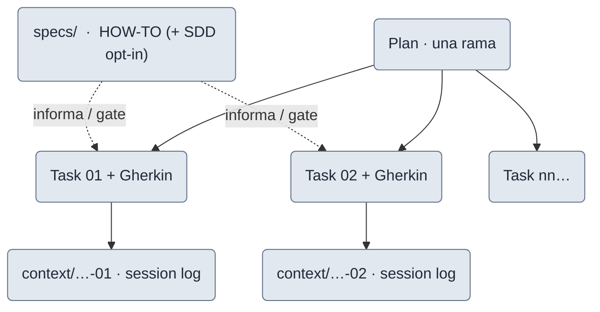

# El modelo

task-pipeline **no impone estructura nueva**: asume que el trabajo se organiza como Markdown versionado
junto al código. Este es el modelo mental —el **qué y el porqué**— que usa todo el resto del portal. El
recorrido de las fases (el **cómo**) vive en [El pipeline paso a paso](/guia/pipeline); aquí solo se define
el vocabulario.

## Todo el trabajo es Markdown versionado

El `.md` es la **fuente de verdad**, no una base de datos ni un tablero externo. Se organiza así:

```
.claude/
  plans/<estado>/<package>/<name-plan>.md      # estado: pending|active|completed|cancelled
  tasks/<estado>/<package>/<task-id>.md
  context/<package>/<task-id>.md               # histórico de sesión (append-only)
  specs/<package>/HOW-TO-START-A-TASK.md        # gate de ejecución por package
  task-pipeline.yml                             # config del repo (ver Referencia)
docs/guides/task-lifecycle.md                  # flujo canónico (estados, plantillas, DoD)
```

## Los cuatro artefactos

| Artefacto | Qué es | Dónde vive |
|---|---|---|
| **Plan** | La unidad de trabajo grande = **una rama**. Contexto/problema, objetivos, alcance, lista de tareas, decisiones de grilling y su changelog. | `.claude/plans/<estado>/<package>/<name-plan>.md` |
| **Task** | Una unidad **pequeña** con criterios de aceptación en **Gherkin**, su `depends_on`, `Provides` y una **Definition of Done**. | `.claude/tasks/<estado>/<package>/<task-id>.md` |
| **Context** | El **session log** append-only de una tarea: arranque, decisiones, verificación, tiempo. No se reescribe: se añade. | `.claude/context/<package>/<task-id>.md` |
| **Specs** | El **HOW-TO** de ejecución por package (gate). Con la capa [SDD](/features/sdd) opt-in, además: spec (EARS), casos de uso (Gherkin) y ADR (MADR). | `.claude/specs/<package>/…` |

## Cómo se relacionan



<small>gris = artefacto. El color de rol (humano/subagente/gate) aparece en los diagramas de fases, no aquí.</small>

- Un **plan** se descompone en varias **tasks**; cada task deja su rastro en un **context** (session log).
- Las **specs** del package informan y actúan de **gate** de ejecución de cada task.
- El estado de plan y de task se refleja en **la carpeta** donde vive el `.md` → ver [Estados](./estados).
- El plan y sus tasks comparten **una rama**; los ids son **plan-scoped** → ver [Ramas e ids](./ramas-e-ids).

## Skills = playbooks, no scripts

Las **skills** del plugin (`/plan-task`, `grilling`, `design-review`…) son **playbooks en Markdown que
Claude sigue**, no código ejecutable. Orquestan el flujo y lanzan **subagentes frescos** para las revisiones
adversarias. Cómo encajan en la secuencia es la [sección Pipeline](/guia/pipeline); su catálogo está en
[Las skills](/skills/).

## Profundizar (opcional)

La convención completa (plantillas, placeholders, gate de ejecución) está en la
[guía de ciclo de vida](https://github.com/drossan/claude-plugins/blob/main/docs/guides/task-lifecycle.md).
No hace falta para entender el modelo.
