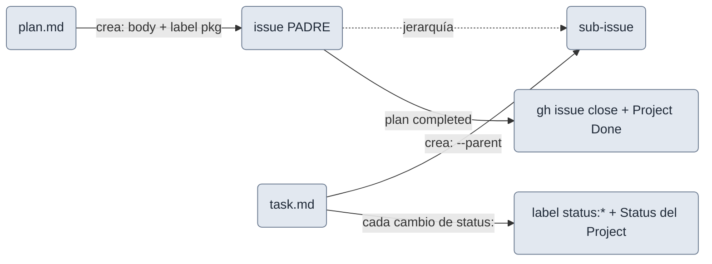

# github-tracking (opcional)

Integración **opt-in** (default `off`) que **proyecta** el trabajo a GitHub Issues/Projects para tener un
orden global glanceable + tablero. El `.md` sigue siendo la **única fuente de verdad**; GitHub es una
**proyección one-way** (`.md` → GitHub).

## Requiere `gh`

La feature **no funciona sin `gh`** instalado y autenticado, con scopes **`repo`** (issues) y **`project`**
(tablero — `gh auth refresh -s project`). Sin `gh`, sin red, sin auth o repo no-GitHub → **no-op** (el flujo
local no cambia).

## Qué proyecta



<small>gris = artefacto/paso. Proyección **one-way** (`.md` → GitHub); el `.md` es la única fuente de verdad.</small>

- **Plan → issue PADRE**; **tarea → SUB-ISSUE** (`gh issue create --parent`).
- **Body = cuerpo completo del `.md`** (sin frontmatter) + **banner de espejo** + link al `.md`. Se vuelca al
  crear y se re-vuelca solo en **re-proyección explícita** (`/doctor` / re-run de `/plan-task`), no en cada
  transición.
- **Label `pkg:<package>`** (creada si falta) → filtro por workspace. **Alta en el Project** con Status
  `Backlog` al crear.
- **Estados** en cada transición, en **dos sitios** (label `status:*` + campo Status del Project): `active` →
  `In progress` + `status: in-progress` (+ **assignee `@me`**) · `in-review` → `In review` +
  `status: in-review` · `blocked` → `status: blocked` (el Project queda `In progress`) · `done` → cerrada +
  `Done` + `status:*` retirada · `cancelled` → cerrada "not planned" + `Done`. Recipe **add-then-remove**.
- Al completar el plan, la **issue PADRE se cierra** + Project `Done` (GitHub no la auto-cierra). El padre
  **no** lleva `status:*` ni assignee.

## Activar

En `.claude/task-pipeline.yml`:

```yaml
features:
  github-tracking:
    enabled: true
    repo: owner/name        # opcional; default = el repo actual
    project: 3              # opcional; nº de Project v2 para el tablero
    assignee: "@me"         # opcional; @me (default) / un login / false para no asignar
```

## Límites honestos

- Proyección **best-effort**: la reconciliación vive en `/doctor` (no garantiza consistencia ante
  paginación, rate-limit, auth caída o issues borradas a mano).
- **Concurrencia**: dos ramas proyectando el **mismo plan** crean padres duplicados; mitigación: **una sola
  rama proyecta el plan**.
- Techos de GitHub: **100 sub-issues por padre**.
- **Issue types omitidos + asimetría (org)**: los issue types nativos son **org-only** (404 en cuenta
  personal). El type se **omite**; en consumidores org el padre puede llevar `issue-type-plan` pero las
  sub-issues **no** llevan type; en cuenta personal, ninguno.
- **`assignee` exige identidad asignable**: si quien corre no es **colaborador asignable** del repo, no
  asigna + avisa (el resto de la proyección sigue).
- **Status del Project = opciones default** (`Backlog/Ready/In progress/In review/Done`, match
  case-insensitive; la opción real es `In progress`, no `In Progress`). Si el Project las nombra distinto →
  salta el Status + avisa (la label `status:*` es el fallback visible).
- **Body sin demonio + límite de tamaño**: se vuelca al crear y en re-proyección explícita, **no** en cada
  guardado (no hay watcher; el trabajo vivo va al session log, que no se proyecta). Un cuerpo que supere el
  **límite de body de GitHub (~65536 chars)** se **trunca** con nota «(ver el `.md`)» conservando banner + link.
- **Huérfanas al desactivar (I3, ampliado)**: desactivar el flag deja huérfanas las **definiciones** de
  labels `pkg:*`/`status:*`, los **items** del Project y las `status:*` pegadas a issues in-flight →
  **reconcilia/limpia ANTES de desactivar** (con el flag off, `/doctor` ya no las detecta).

## Profundizar (opcional)

La **tabla completa de config** (todas las claves, `issue-type-plan`), el ciclo de vida del padre y los
**riesgos aceptados** al detalle están en el
[README del plugin → GitHub tracking](https://github.com/drossan/claude-plugins/blob/main/task-pipeline/README.md#github-tracking-opcional);
la mecánica exacta de cada transición de estado, en la
[guía de ciclo de vida](https://github.com/drossan/claude-plugins/blob/main/docs/guides/task-lifecycle.md).
