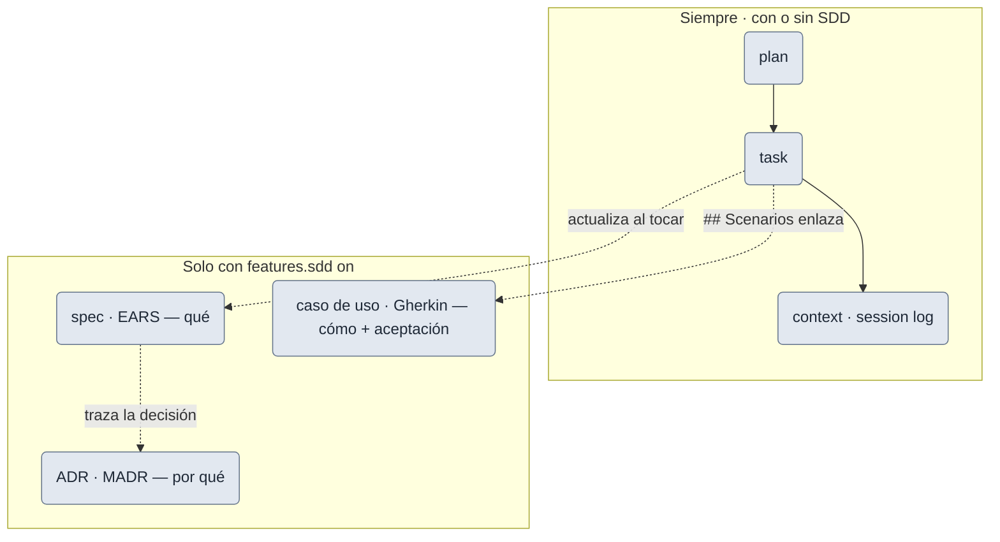
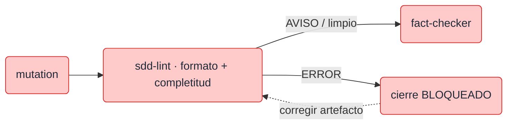

# SDD nativo (opcional)

Capa **opt-in** (default `off`) de **Spec-Driven Development**: eleva la fuente de verdad de la prosa en
`docs/` a artefactos **vivos** —**spec** de requisitos (EARS), **casos de uso** (Gherkin) y **ADR** (MADR
4.0.0)— que cada tarea mantiene.

## Activar

En `.claude/task-pipeline.yml`:

```yaml
features:
  sdd: true    # false (default) | true
```

## Qué envía

**Plantillas, no contenido** (nada se autogenera): las semillas `spec.md`, `caso-de-uso.md`, `adr.md` y
`adr-index.md`, que se materializan en:

- `.claude/specs/<pkg>/spec.md` — requisitos (user stories P1/P2/P3 + EARS + criterios `SC-00x`).
- `.claude/specs/<pkg>/casos-de-uso/<id>.md` — casos de uso (Cockburn + **el Gherkin de aceptación**).
- `.claude/specs/adr/NNNN-*.md` + `adr-index.md` — decisiones de arquitectura (MADR 4.0.0, `NNNN` desde
  `0001`, sin `ADR-0000` de relleno).

## El flujo, con y sin SDD

Lo que **no cambia**: el bucle `plan → task → context` y los checkpoints/gates del pipeline son los mismos.
Lo que cambia es **dónde vive la fuente de verdad** de requisitos, decisiones y escenarios.

| | Sin SDD (default) | Con `features.sdd` on |
|---|---|---|
| **Gherkin de aceptación** | en la tarea (`task.md`) | en el **caso de uso**; la tarea `## Scenarios` **enlaza** (no copia) |
| **Requisitos** | prosa del plan / `docs/` | **spec** viva — EARS (*qué*) |
| **Decisiones** | plan / mensaje de commit | **ADR** — MADR (*por qué*) |
| **Cierre de tarea** | `mutation → fact-checker` | + gate **`sdd-lint`** entre ambos |
| **DoD** | — | *gated*: no cierra sin actualizar spec + CU que toca, **o** declarar "sin cambios de spec/CU" |

Con el flag on, los tres artefactos se reparten el trabajo sin duplicarse, alrededor del mismo bucle:



<small>gris = artefacto. Anti-duplicación: **ADR** = *por qué* · **Spec (EARS)** = *qué* · **CU (Gherkin)** = *cómo + aceptación*.</small>

- **Fuente única del Gherkin = el caso de uso.** `scenario-coverage` y `/mutation` **siguen el enlace al CU**:
  la QA retro-alimenta el CU; el bucle de survivors localiza el escenario en el CU, no en la tarea.
- **Enlace roto** → se reporta (no se asume "sin escenarios"). **Toggle a mitad**: las tareas inline previas
  **conviven** y **no se migran a la fuerza**; la regla aplica a las tareas nuevas.

## Garantías opt-in

- **Fail-safe**: SOLO `features.sdd: true` (booleano) activa. Ausente / `false` / `"true"` / `yes` / `1` /
  `TRUE` / la forma-bloque / comentado → **off**, sin error de parseo.
- **Fuera de todo preset**: `mode: full` **no** lo enciende; es una decisión explícita.
- **Ausencia ≠ drift**: `/doctor` no reporta la falta del flag ni de las plantillas SDD salvo que el flag
  esté **on** (mismo criterio que `caveman`/`github-tracking`).
- **Off = comportamiento idéntico al de hoy**: sin el flag, el Gherkin vive en la tarea (`task.md`).

## Gate de validación (`/sdd-lint`)

Con SDD on, al **cerrar una tarea** (entre `/mutation` y `fact-checker`) corre `sdd-lint`: valida **formato +
completitud** de los artefactos — EARS bien-formado, estado MADR coherente, disciplina Gherkin, `[NECESITA
ACLARACIÓN]` sin resolver, enlaces/trazabilidad. **ERROR bloquea** el cierre; **AVISO** se reconoce.



<small>rojo = gate de cierre.</small>

Invocable a mano (`/sdd-lint [package]`) para auditar, y con un **helper Bash opcional**
(`scripts/sdd-lint.sh`) que un repo con CI puede cablear para validación desatendida.

## Profundizar (opcional)

El flujo SDD paso a paso está en la
[guía de ciclo de vida → "Flujo SDD"](https://github.com/drossan/claude-plugins/blob/main/docs/guides/task-lifecycle.md);
el detalle formal de EARS/MADR/Gherkin, en el
[README del plugin → SDD nativo](https://github.com/drossan/claude-plugins/blob/main/task-pipeline/README.md#sdd-nativo-opcional).
