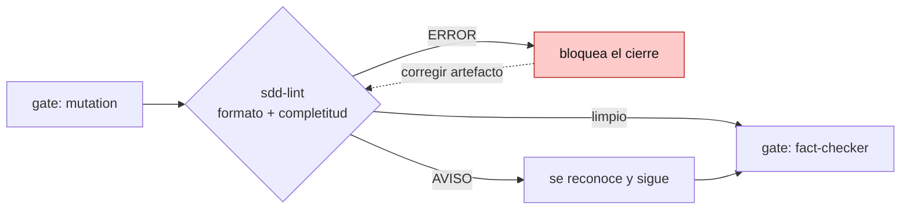

# SDD nativo (opcional)

Capa **opt-in** (default `off`) de **Spec-Driven Development**: eleva la fuente de verdad de la prosa en
`docs/` a artefactos **vivos** —**spec** de requisitos (EARS), **casos de uso** (Gherkin) y **ADR** (MADR
4.0.0)— que cada tarea mantiene.

## Activar

En `.claude/task-pipeline.yml`:

```yaml
features:
  sdd: true    # false (default) | true
```

## Qué envía

**Plantillas, no contenido** (nada se autogenera): las semillas `spec.md`, `caso-de-uso.md`, `adr.md` y
`adr-index.md`, que se materializan en:

- `.claude/specs/<pkg>/spec.md` — requisitos (user stories P1/P2/P3 + EARS + criterios `SC-00x`).
- `.claude/specs/<pkg>/casos-de-uso/<id>.md` — casos de uso (Cockburn + **el Gherkin de aceptación**).
- `.claude/specs/adr/NNNN-*.md` + `adr-index.md` — decisiones de arquitectura (MADR 4.0.0, `NNNN` desde
  `0001`, sin `ADR-0000` de relleno).

## Garantías opt-in

- **Fail-safe**: SOLO `features.sdd: true` (booleano) activa. Ausente / `false` / `"true"` / `yes` / `1` /
  `TRUE` / la forma-bloque / comentado → **off**, sin error de parseo.
- **Fuera de todo preset**: `mode: full` **no** lo enciende; es una decisión explícita.
- **Ausencia ≠ drift**: `/doctor` no reporta la falta del flag ni de las plantillas SDD salvo que el flag
  esté **on** (mismo criterio que `caveman`/`github-tracking`).
- **Off = comportamiento idéntico al de hoy**: sin el flag, el Gherkin vive en la tarea (`task.md`).

## Flujo (con el flag on)

- **Fuente única del Gherkin = el caso de uso.** El `## Scenarios` de la tarea **enlaza** al CU en vez de
  copiar el bloque. Anti-duplicación: **ADR** = *por qué* · **Spec (EARS)** = *qué* · **CU (Gherkin)** =
  *cómo + aceptación*.
- **DoD gated**: la tarea no cierra sin actualizar la spec + el CU que toca, **o** declarar "sin cambios de
  spec/CU" (en el checkbox de la DoD y el session log).
- **`scenario-coverage` y `/mutation` siguen el enlace al CU**: la QA retro-alimenta el CU; el bucle de
  survivors localiza el escenario en el CU.
- **Enlace roto** → se reporta. **Toggle a mitad**: las tareas inline previas conviven y no se migran a la
  fuerza; la regla aplica a las tareas nuevas.

## Gate de validación (`/sdd-lint`)



Con SDD on, al **cerrar una tarea** (entre `/mutation` y `fact-checker`) corre `sdd-lint`: valida **formato +
completitud** de los artefactos — EARS bien-formado, estado MADR coherente, disciplina Gherkin, `[NECESITA
ACLARACIÓN]` sin resolver, enlaces/trazabilidad. **ERROR bloquea** el cierre; **AVISO** se reconoce. Invocable
a mano (`/sdd-lint [package]`) para auditar, y con un **helper Bash opcional** (`scripts/sdd-lint.sh`) que un
repo con CI puede cablear para validación desatendida.

> **Fuente canónica**: detalle en el
> [README del plugin → SDD nativo](https://github.com/drossan/claude-plugins/blob/main/task-pipeline/README.md).
