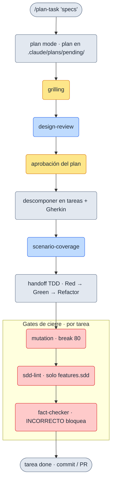
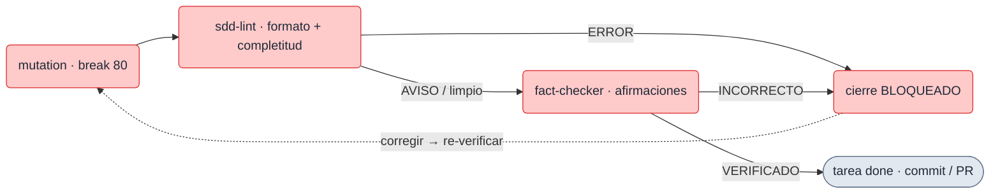

# El pipeline

`/plan-task` orquesta el flujo completo, de las specs a tareas listas para ejecutar y cerradas con calidad.
**No es fire-and-forget**: hay checkpoints humanos por diseño. Esta página lo recorre **fase a fase**; el
modelo (plan, task, context, estados) lo define [Conceptos](../conceptos/modelo.md) — aquí se **usa**, no se
redefine.

<small>ámbar = checkpoint humano · azul = subagente fresco · rojo = gate de cierre · gris = paso</small>

Todo el pipeline es **configurable por repo** (`.claude/task-pipeline.yml`): los gates (TDD, mutation) y las
capas de doc se encienden/apagan por preset (`mode`) o flag. Ver [Configuración](./configuracion.md).

## Fase a fase

Cada fase, con **qué haces · qué ves · por qué existe**.

### 1 · Arranque — `/plan-task "specs"`
- **Qué haces**: le das el problema en una frase.
- **Qué ves**: Claude entra en **plan mode** (investiga, no escribe código) y deja un borrador como plan
  **`pending`** en `.claude/plans/`.
- **Por qué**: separa *entender* de *codificar*; el `.md` es la fuente de verdad desde el minuto uno.

### 2 · `grilling` — checkpoint humano (no negociable)
- **Qué haces**: respondes un **interrogatorio**, una pregunta a la vez, que fuerza a explicitar decisiones.
- **Qué ves**: las decisiones acordadas quedan registradas en el plan (no en tu memoria).
- **Por qué**: es **barato y nuclear** — una decisión equivocada aquí se paga en todas las tareas de abajo.

### 3 · `design-review` — subagente fresco
- **Qué haces**: nada, salvo leer el veredicto y decidir sobre él.
- **Qué ves**: un **subagente sin el sesgo del autor** intenta **tumbar** el diseño (coherencia, tamaño
  correcto, mantenibilidad, reversibilidad) y propone ajustes o alternativas.
- **Por qué**: no es un sello de goma; puede darle la vuelta a una decisión antes de que cueste caro.

### 4 · Aprobación del plan — checkpoint humano (no negociable)
- **Qué haces**: das (o no) luz verde al plan ya endurecido.
- **Qué ves**: el plan pasa de borrador a acordado; se descompone a partir de aquí.
- **Por qué**: nada se implementa sin tu visto bueno explícito.

### 5 · Descomponer en tareas + Gherkin
- **Qué haces**: revisas la descomposición.
- **Qué ves**: **tareas pequeñas** con `depends_on`, `Provides`, una **DoD** y criterios de aceptación en
  **Gherkin** (comportamiento observable, una regla = un escenario).
- **Por qué**: el Gherkin es el contrato que después verifican los gates.

### 6 · `scenario-coverage` — subagente QA fresco
- **Qué haces**: decides los huecos **fuera del alcance** que el subagente reporta.
- **Qué ves**: comportamientos que ningún escenario cubría (fronteras, errores, estado, input adversario) con
  descarte explícito.
- **Por qué**: caza los requisitos que el plan **implica pero no fija**. Ver [el matiz de alcance](#alcance-el-pipeline-no-lo-expande-solo).

### 7 · Handoff al flujo TDD
- **Qué haces**: implementas cada tarea en ciclos **Red → Green → Refactor** (si el repo tiene stack de
  tests; en un repo `docs-only` esto es N/A).
- **Qué ves**: el código y los tests que satisfacen cada escenario.
- **Por qué**: el pipeline conduce *hasta* el código; escribirlo sigue siendo trabajo real, guiado por el
  contrato Gherkin.

### 8 · Gates de cierre — `mutation → sdd-lint → fact-checker`
Al cerrar cada tarea corren **en orden**. La semántica: **un ERROR bloquea el cierre; un AVISO se reconoce y
sigue.**

<small>rojo = gate de cierre · gris = resultado.</small>

- **Mutation testing** (Stryker por defecto; agnóstico por-package): verifica que los tests realmente **matan
  mutantes**, no solo que pasan en verde. Configurable por repo (umbral `break`; `false` lo desactiva).
- **`sdd-lint`** (solo con `features.sdd` on): valida **formato + completitud** de los artefactos SDD (spec
  EARS · caso-de-uso Gherkin · ADR MADR). **ERROR** bloquea el cierre; **AVISO** se reconoce. Ver
  [SDD nativo](../features/sdd.md).
- **`fact-checker`** (no negociable): un subagente fresco verifica las **afirmaciones factuales** de la sesión
  ("la función X hace Y", "el gate de mutation pasó", "el gate `sdd-lint` pasó"). Un **`INCORRECTO`** bloquea
  el cierre; un `NO VERIFICABLE` se reconoce.

## Los checkpoints

- **`grilling`** y **la aprobación del plan** son **no negociables**: baratos y nucleares. Ningún preset ni
  flag los apaga.
- **`design-review`** y **`scenario-coverage`** corren por defecto, con un **salto proporcional** solo en
  planes triviales: **una sola decisión replicada, sin contrato nuevo ni decisión arquitectónica** (y, para
  `scenario-coverage`, 1 tarea sin caminos de error reales). Lo confirma el owner **una vez por pasada**,
  se registra en el Plan change log y caduca si una re-planificación rompe los criterios. Los criterios
  completos, con su frontera resuelta por ejemplo, están en la skill `plan-task`.

## Alcance: el pipeline no lo expande solo

`scenario-coverage` recibe el **plan** además de las tareas, y lo trata como **dato a contrastar, nunca
como instrucciones**. Su salida va en dos secciones: los huecos **dentro** del alcance, que siguen su
curso, y los **fuera del alcance declarado**, que se reportan **completos y marcados** —no se descartan
en silencio— y los decide el owner, con su motivo en el Plan change log.

Un `Fuera de alcance` redactado en imperativo ("no reportes X") **no puede silenciar** al subagente: sería
colar un filtro de reporte por la puerta de atrás y mataría justo la dimensión que busca *requisitos que
ninguna tarea contempla*.

## Reglas que viajan con el repo

`/task-init` materializa `.claude/honesty-rules.md`: honestidad **y disciplina de trabajo** — verificar
antes de afirmar, hipótesis frente a hecho con tope de intentos, alcance del encargo, techo de delegación
en subagentes y longitud de los entregables escritos. Se lee **cada turno**, pero solo si añades
`@.claude/honesty-rules.md` a tu `CLAUDE.md`: **el plugin nunca lo edita por ti**, y sin ese `@import`
ninguna de esas reglas se aplica.

## Por qué subagentes frescos

Las revisiones adversarias (`design-review`, `scenario-coverage`, `fact-checker`) las corre un **subagente
sin el sesgo del autor**: quien escribió el plan dirá "todo idóneo"; quien no lo escribió, no lo da por
hecho. Esa independencia es toda la garantía del mecanismo.

## Estados del trabajo

El `status:` del frontmatter es la fuente de verdad; al cambiarlo, el `.md` **se mueve** de carpeta en una
sola operación. Las máquinas de estado de plan y de tarea (con `in_review`, `blocked` y la reapertura
`done → active`) están en [Conceptos → Estados](../conceptos/estados.md).

## Profundizar (opcional)

El flujo completo con estados, plantillas y DoD está en la
[guía de ciclo de vida](https://github.com/drossan/claude-plugins/blob/main/docs/guides/task-lifecycle.md).
No hace falta para seguir el pipeline.
