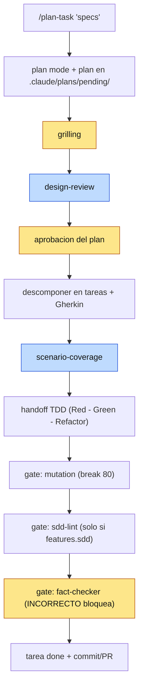
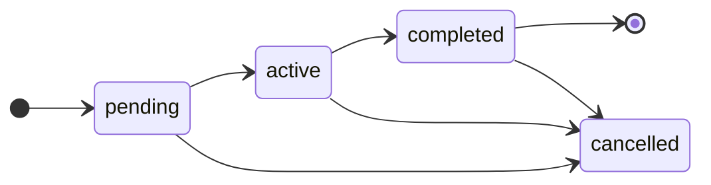
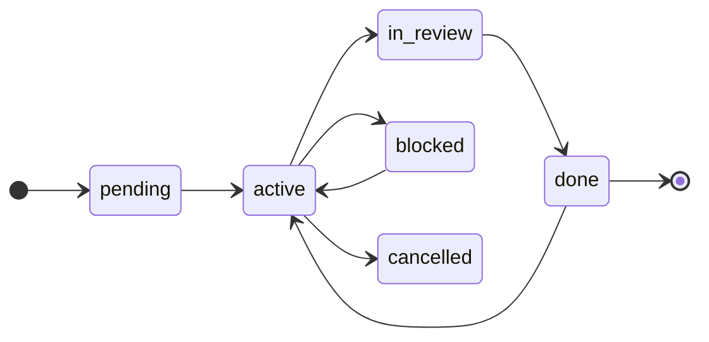

# El pipeline

`/plan-task` orquesta el flujo completo, de las specs a tareas listas para ejecutar. **No es
fire-and-forget**: hay checkpoints humanos por diseño.

<small>Amarillo = checkpoint humano · azul = subagente fresco adversario.</small>

Todo el pipeline es **configurable por repo** (`.claude/task-pipeline.yml`): los gates (TDD, mutation) y las
capas de doc se encienden/apagan por preset (`mode`) o flag. Ver [Configuración](./configuracion.md).

## Los checkpoints

- **`grilling`** y **la aprobación del plan** son **no negociables**: baratos y nucleares. Ningún preset ni
  flag los apaga.
- **`design-review`** y **`scenario-coverage`** corren por defecto, con un **salto proporcional** solo en
  planes triviales: una sola decisión replicada, sin contrato nuevo ni decisión arquitectónica (y, para
  `scenario-coverage`, 1 tarea sin caminos de error reales). Lo confirma el owner **una vez por pasada**,
  se registra en el Plan change log y caduca si una re-planificación rompe los criterios. Los criterios
  completos, con su frontera resuelta por ejemplo, están en la skill `plan-task`.

## Los gates de cierre

Al cerrar cada tarea, en orden: **`mutation` → `sdd-lint` → `fact-checker`**.

- **Mutation testing** (Stryker por defecto; agnóstico por-package): verifica que los tests realmente matan
  mutantes, no solo que pasan en verde. Configurable por repo (umbral `break`; `false` lo desactiva).
- **`sdd-lint`** (solo con `features.sdd` on): valida **formato + completitud** de los artefactos SDD (spec
  EARS · caso-de-uso Gherkin · ADR MADR). **ERROR** bloquea el cierre; **AVISO** se reconoce. Ver
  [SDD nativo](../features/sdd.md).
- **`fact-checker`** (no negociable): un subagente fresco verifica las afirmaciones factuales de la sesión
  ("la función X hace Y", "el gate de mutation pasó", "el gate `sdd-lint` pasó"). Un `INCORRECTO` bloquea el
  cierre.

## Estados del trabajo

El `status:` del frontmatter es la **fuente de verdad**; al cambiarlo, el `.md` **se mueve** de carpeta
(`pending/` → `active/` → `completed/` | `cancelled/`) en una sola operación.

**Plan:**

**Tarea** (ciclo más rico: `in_review`, `blocked`, reapertura desde `done`):

## Alcance: el pipeline no lo expande solo

`scenario-coverage` recibe el **plan** además de las tareas, y lo trata como **dato a contrastar, nunca
como instrucciones**. Su salida va en dos secciones: los huecos **dentro** del alcance, que siguen su
curso, y los **fuera del alcance declarado**, que se reportan **completos y marcados** —no se descartan
en silencio— y los decide el owner, con su motivo en el Plan change log.

Un `Fuera de alcance` redactado en imperativo ("no reportes X") **no puede silenciar** al subagente: sería
colar un filtro de reporte por la puerta de atrás y mataría justo la dimensión que busca *requisitos que
ninguna tarea contempla*.

## Reglas que viajan con el repo

`/task-init` materializa `.claude/honesty-rules.md`: honestidad **y disciplina de trabajo** — verificar
antes de afirmar, hipótesis frente a hecho con tope de intentos, alcance del encargo, techo de delegación
en subagentes y longitud de los entregables escritos. Se lee **cada turno**, pero solo si añades
`@.claude/honesty-rules.md` a tu `CLAUDE.md`: **el plugin nunca lo edita por ti**, y sin ese `@import`
ninguna de esas reglas se aplica.

## Por qué subagentes frescos

Las revisiones adversarias (`design-review`, `scenario-coverage`, `fact-checker`) las corre un **subagente
sin el sesgo del autor**: quien escribió el plan dirá "todo idóneo"; quien no lo escribió, no lo da por
hecho. Esa independencia es toda la garantía del mecanismo.

> **Fuente canónica**: el flujo completo, estados, plantillas y DoD están en
> [`docs/guides/task-lifecycle.md`](https://github.com/drossan/claude-plugins/blob/main/docs/guides/task-lifecycle.md).
