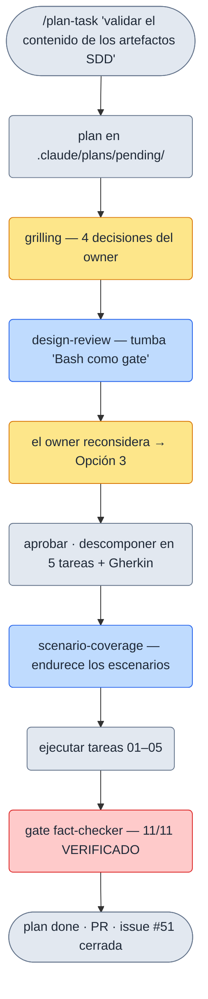

# Tu primer plan

Esta página recorre **un caso real y cerrado** de este mismo repo, de principio a fin, para que veas cómo se
siente el pipeline por dentro: qué escribe Claude, qué revisan los subagentes y —lo importante— **qué decides
tú** en cada checkpoint humano.

El caso es `sdd-validation-gate`: añadir un **gate que valida el contenido de los artefactos SDD** (que una
spec sea EARS válido, que un ADR tenga un estado coherente…). No necesitas entender ese tema para seguir el
recorrido: fíjate en el **flujo**, no en el asunto.

> Los recuadros marcados **«Copia congelada»** son extractos abreviados de ficheros reales de `.claude/**`
> (que el portal no publica). Se copiaron el 2026-08-14; si el original cambiara, el barrido de coherencia lo
> detecta.

## El recorrido de un vistazo



<small>ámbar = checkpoint humano · azul = subagente fresco · rojo = gate de cierre · gris = paso/artefacto</small>

## Paso 1 · Arrancar: `/plan-task`

Todo empieza con una frase. Le das a Claude el problema y `/plan-task` entra en **plan mode** (investiga, no
escribe código), redacta un borrador y lo guarda como plan **`pending`** en `.claude/plans/`. El `.md` es la
fuente de verdad; su `status:` en el frontmatter dice en qué fase está.

**Copia congelada** (2026-08-14) · origen: `.claude/plans/completed/task-pipeline/sdd-validation-gate.md`

```markdown
---
id: task-pipeline-sdd-validation-gate
package: task-pipeline
status: completed        # pending | active | completed | cancelled
branch: plan/task-pipeline/sdd-validation-gate
issue: 51                # issue PADRE (github-tracking)
---

# `sdd-validation-gate`: gate de validación de formato + completitud de artefactos SDD

## Contexto y problema

La capa SDD (v0.15.0) shipeó plantillas + flujo + `/doctor` de presencia, pero **no valida el CONTENIDO**
de los artefactos SDD al escribirlos/cerrarlos. Hueco (señalado por el owner como "gran fallo de diseño"):
nadie comprueba que una spec sea EARS válido, que un ADR tenga un estado MADR coherente, ni que no queden
`[NECESITA ACLARACIÓN]` sin resolver.
```

En este caso, antes de cerrar el borrador Claude usó `AskUserQuestion` para dos decisiones de fondo: el
**mecanismo** del gate (¿Bash, skill, o híbrido?) y el **enganche** (¿al cerrar la tarea, invocable a mano, o
ambos?). Tú eliges; Claude propone, no decide por su cuenta.

## Paso 2 · `grilling` (checkpoint humano · no negociable)

Con el borrador aprobado, `grilling` te **interroga** sobre él: fuerza a que las decisiones sean explícitas
antes de gastar esfuerzo. Es barato y nuclear —ningún flag lo apaga— porque una decisión equivocada aquí se
paga en todas las tareas de abajo.

**Copia congelada** (2026-08-14) · origen: `.claude/plans/completed/task-pipeline/sdd-validation-gate.md` (Registro de cambios → grilling)

```text
grilling — decisiones del owner:
  1. Severidad de dos niveles: ERROR bloquea / AVISO no bloquea (mismo modelo que fact-checker).
  2. Gate intrínseco a `features.sdd` (sin flag propio): si SDD on, corre al cerrar.
  3. Frontera Bash↔skill: Bash = determinista (presencia/enlace/formato); skill = juicio (EARS/MADR bien formado).
  4. `sdd-lint` = gate propio, corre ANTES de fact-checker → secuencia mutation → sdd-lint → fact-checker.
```

**Lo que decides tú aquí:** las cuatro respuestas de arriba. Salen de las preguntas de `grilling` y quedan
registradas en el plan (sección "Decisiones de grilling"), no en tu memoria.

## Paso 3 · `design-review` (subagente fresco · el que puede cambiarlo todo)

Aquí un **subagente sin el sesgo del autor** intenta **tumbar** el diseño entero: coherencia, tamaño correcto,
mantenibilidad, reversibilidad. No es un sello de goma. En este caso encontró un fallo estructural:

**Copia congelada** (2026-08-14) · origen: `.claude/plans/completed/task-pipeline/sdd-validation-gate.md` (Registro de cambios → design-review)

```text
Hallazgo material: la capa Bash como GATE no encaja con "skills = playbooks, no scripts" + stack: none
(no hay hook de cierre → el modelo invoca el Bash igual; su determinismo neto es marginal; 3 fuentes de
reglas; fixtures-sin-harness = teatro). La alternativa "todo model-driven" es más fuerte.

Decisión del owner (reconsideración) → Opción 3:
  - El GATE que bloquea = skill `sdd-lint` model-driven (fuente ÚNICA y autoritativa de reglas).
  - El Bash = herramienta OPCIONAL, NO bloqueante, shipeable (para CI de un repo consumidor).
```

**Lo que decides tú aquí:** la `design-review` no reescribe el plan sola. Te presenta el trade-off y **tú**
reconsideras. La decisión de fondo del grilling (mecanismo "híbrido Bash + skill") se dio la vuelta a
"skill = gate, Bash = helper opcional". Ese giro —confirmado en la retro como acertado— es exactamente el
valor del checkpoint: sin él, se habría construido un gate frágil.

## Paso 4 · Aprobar el plan y descomponer en tareas Gherkin

Con el diseño en pie, **apruebas el plan** (el segundo checkpoint humano no negociable) y Claude lo descompone
en **tareas pequeñas** con dependencias y **criterios de aceptación en Gherkin**. Cada tarea es un `.md`
propio en `.claude/tasks/pending/`.

**Copia congelada** (2026-08-14) · origen: `.claude/tasks/completed/task-pipeline/task-pipeline-sdd-validation-gate-01.md`

```gherkin
Feature: Gate de validación SDD (skill model-driven)

  Scenario: estado MADR inválido = ERROR (bloquea)
    Given un `adr/0001-x.md` con `- **Estado**: aceptado` (no canónico)
    When corro `/sdd-lint`
    Then reporta ERROR "estado MADR inválido" (∈ los 5 válidos) y bloquea

  Scenario: FR que no es EARS = AVISO (no bloquea)
    Given un `spec.md` con un FR en prosa suelta que no encaja en ningún patrón EARS
    When corro `/sdd-lint`
    Then reporta AVISO "EARS mal formado" y NO bloquea

  Scenario: features.sdd off = no-op
    Given `features.sdd` off (default)
    When corro `/sdd-lint`
    Then informa que SDD está off y no valida nada
```

Los escenarios son el **contrato**: describen comportamiento observable (una regla = un escenario), no cómo se
implementa. Son lo que después se verifica al cerrar.

## Paso 5 · `scenario-coverage` (subagente QA fresco)

Otro subagente fresco caza **comportamientos que ningún escenario cubre**: fronteras, errores, estado,
input adversario, y lo que el plan **implica pero no fija**. Recibe el plan como *dato a contrastar*, nunca
como instrucciones —un `Fuera de alcance` redactado en imperativo no puede silenciarlo—. Los huecos dentro
del alcance se endurecen; los de fuera se te reportan **marcados**, y **tú** decides. En este caso añadió,
p.ej., que el vocabulario MADR fuera *case-insensitive* y que los ids duplicados se comprobaran por-package.

## Paso 6 · Ejecutar y cerrar con gates

Cada tarea pasa a `active`, se implementa y se cierra contra su **Definition of Done**. El cierre corre los
**gates** en orden: `mutation → sdd-lint → fact-checker`. Aquí el stack del repo es `none` (Markdown), así que
mutation/TDD son **N/A**; el gate que sí corre —**siempre**— es `fact-checker`: un subagente fresco verifica
las afirmaciones factuales de la sesión ("la función X existe", "los tests pasan"). Un `INCORRECTO` bloquea.

**Copia congelada** (2026-08-14) · origen: `.claude/context/task-pipeline/task-pipeline-sdd-validation-gate-01.md` (session log → Cierre)

```text
### Verificación corrida + resultado
- 8 escenarios Gherkin + hardening verificados por inspección/grep sobre la skill: cumplidos.
- Gate fact-checker (subagente fresco, sonnet): 11/11 VERIFICADO, 0 INCORRECTO.
- Sin identificadores muertos.
```

Cada tarea deja su **session log** append-only en `.claude/context/` (arranque, decisiones, verificación,
tiempo real vs. estimado). Cuando todas cierran, el plan pasa a `completed`, se abre el PR y —con
`github-tracking` on— la issue padre #51 se cierra. La **retro** del plan anotó las sorpresas reales: el
helper Bash usó `mapfile` (Bash 4+) y **falló en el Bash 3.2 de macOS**; y correr el lint sobre sus propias
plantillas destapó un **falso positivo** en el check de ids (`NFR-001` contiene `FR-001`). Ambos, capturados
y corregidos dentro del propio flujo.

## Qué decides tú, resumido

| Checkpoint | Quién actúa | Qué haces tú |
|---|---|---|
| `AskUserQuestion` (en plan mode) | Claude pregunta | Eliges mecanismo y enganche |
| **grilling** | Claude te interroga | Fijas las decisiones de fondo (aquí, 4) |
| **design-review** | Subagente fresco | Reconsideras ante el trade-off (aquí, giro a Opción 3) |
| **aprobar el plan** | Tú | Das luz verde a la descomposición |
| **scenario-coverage** | Subagente QA | Decides los huecos *fuera de alcance* que reporta |
| **gates de cierre** | Automáticos | Revisas; un `INCORRECTO` de fact-checker bloquea |

Los dos checkpoints en negrita-cursiva del pipeline (**grilling** y **aprobar el plan**) no los apaga ningún
flag. El resto se adapta al repo y al tamaño del plan.

## Siguiente paso

- [El pipeline](./pipeline.md) — el detalle de cada fase y cada gate, fuera de un caso concreto.
- [Conceptos](../conceptos/modelo.md) — el modelo estático: plan/task/context/specs, estados, ramas e ids.

## Profundizar (opcional)

El flujo completo, con estados, plantillas y DoD, está en la
[guía de ciclo de vida](https://github.com/drossan/claude-plugins/blob/main/docs/guides/task-lifecycle.md).
No hace falta para seguir tu primer plan.
